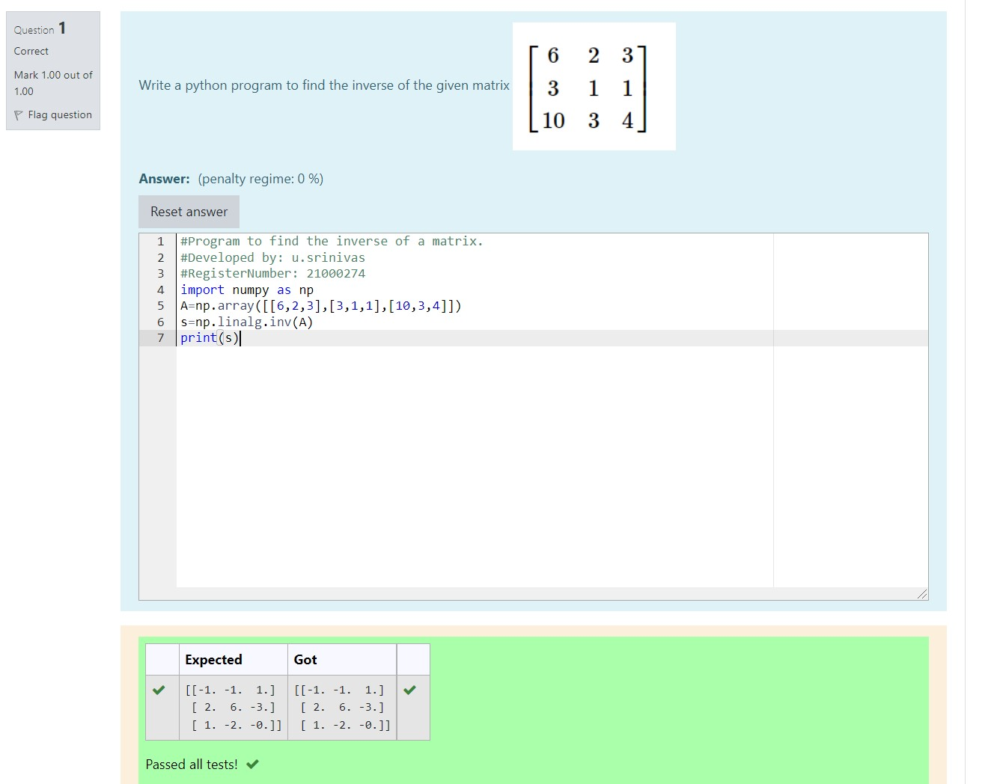

# INVERSE-OF-A-MATRIX
## Aim:
To write a python program to find the inverse of a matrix
## Equipment’s required:
1. 	Hardware – PCs
2. 	Anaconda – Python 3.7 Installation / Moodle-Code Runner
## Algorithm:
### Step1 : 
created the python code 
### Step 2:
get the values from the user
### Step 3: 
disply the output
### Step 4: 
end the program

## Program:
~~~
import numpy as np
A=np.array([[6,2,3],[3,1,1],[10,3,4]])
s=np.linalg.inv(A)
print(s)
~~~
## Output:

## Result:
Thus the inverse of given matrix is successfully solved using python program

